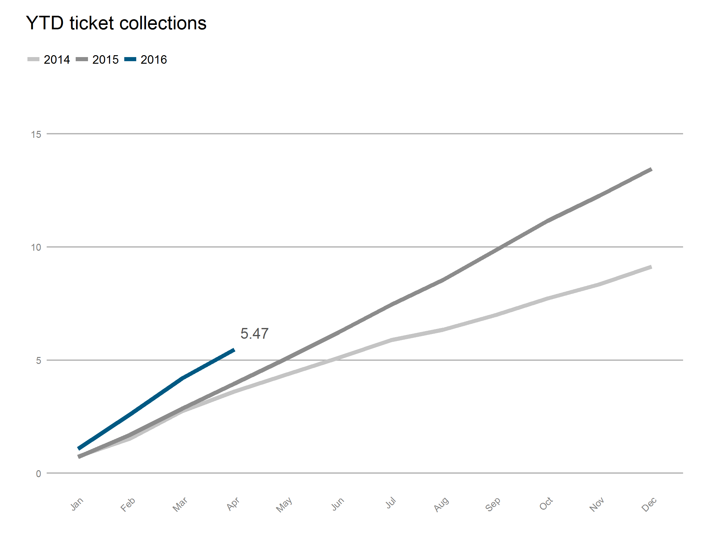

# BottomLineSTAT

### Done
* First draft of YTD revenue cleaning and plotting

###To-Dos
* Data cleaning:
    * One-time revenue items(?)
    * YTD revenue projections
    * Non-revenue activities and projections (if applicable)
    
* Plotting:
    * Revenues
        * Need to figure out way to plot collections/revenues against projections
        * Figure out how to render revenue plots as currency. (currency arg currently having no effect)
    * Non-revenue items
        * Everything
 

### Dependencies

 * gdata
 * zoo
 * dplyr
 * ggplot2
 * lubridate
 * stringr
 * scales
 * reshape2
 
 
 